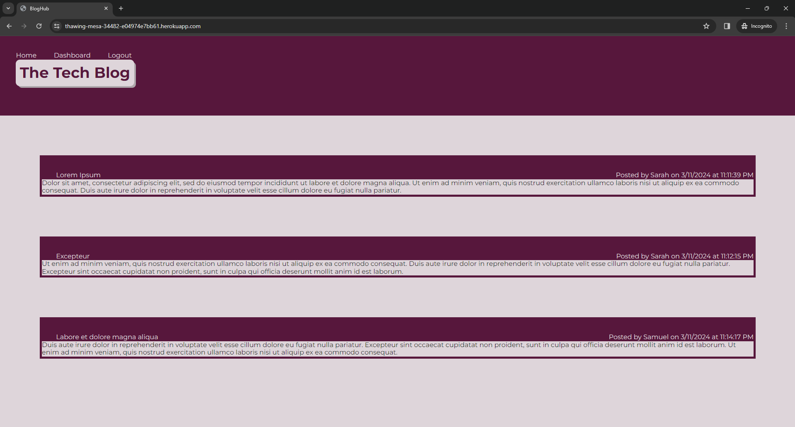

# Mod14-MVC-BlogHub

## Description

MSU Coding Bootcamp Module 14 Challenge: Tech Blog

The purpose of this project was to build from scratch a CMS-style blog site similar to a Wordpress site, where users can publish blog posts and comment on other users' posts as well. This was built from scratch, but using class exercises as a guide, then deployed to Heroku. This app follows the MVC paradigm in its architectural structure, using Handlebars.js as the templating language, Sequelize as the ORM, and the express-session npm package for authentication.

Future development would include:

- Allowing a user to delete or update posts/comments
- Improved styling
- Add user input validation and improved error messages

## Installation

- Repo: [GitHub Repo](https://github.com/ECiarabellini/Mod14-MVC-BlogHub)
- Deployed to Heroku: [Heroku page](https://thawing-mesa-34482-e04974e7bb61.herokuapp.com/)
- Image of Dashboard when user logged in: 

## Usage

To run:

- Run 'npm install' from the command line
- Open mysql. Type source db/schema.sql. Exit mysql.
- Run 'node seeds/index.js' from the command line to seed the database
- Run 'npm start' to start the server.

## Credits

- ChatGPT helped me to create the POST API route for Products, which I then updated to also create Tags and Categories.
- Several API routes were mirrored from module 13 exercise 24
- I copied models/User.js and seeds folder entirely from module 13 exercise 24 then updated to include blog posts.
- I copied the login and signup form files and related routes from module 14 exercize 28.
- Many other files were direct copy/paste from various exercises, updating and revising them to use the variable names that I required for this project.

## License

MIT License
